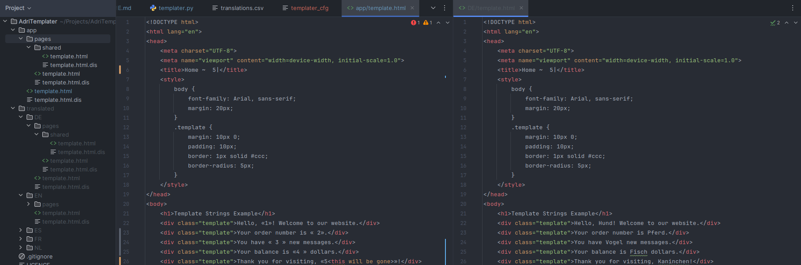
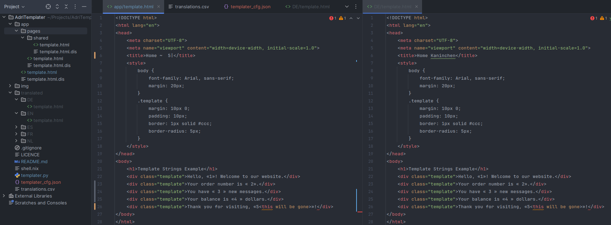

# AdriTemplater

A simple templating engine powered by python. Although initially made for the purpose of creating multilingual single page websites, it is written with the possiblity of broadening its usecases in mind. It basically creates copies of projects, replacing template sections (more on this later) with a specific string.

## Usage
To get started you only need the python file (and python duh), but you can use the additional files as a starting point.
- `git clone https://github.com/Adrigorithm/AdriTemplater.git`
- `cd AdriTemplater`

### Run it
Now it is time to run the script.
- `python3 templater.py` (or `python3 templater.py -h`) will show you the CLI synopsis, this is your main reference.
An example command could be:
- `python3 templater.py translations.csv app translated`
This will do a few things. It will recursively copy all files from the `app` directory whist replacing every **template string** with a matching translation. For every language it can find in `translations.csv`, it will create (if it did not exist) a directory named so in `translated` and create all the templated files for the languages inside. The directory tree remains unchanged after the language directories (screenshot below).
- **template string** is something like `« n »` where `n` should be an integer matching the translations on line nr. `n + 2`. So `« 0 »` would match the 2nd line of `translations.csv`, which is the first actual translation.

### Configuration
You can configure a lot. All options **except** for **patterns** are configurable though the cli as command parameters. For **patterns**, you will need to use the configuration file. The configuration can hold all config options as well (except `config_file`, obviously), but CLI parameters take priority. See examples below.
- `patterns` is a list of globbing pattern, which combined, describe which files should be templated. It will not template the same file twice. Defaults to `**/*` (All files from `input_dir` directory (recursively enumerates all subdirectories)).
- `language_file` is the path (starting from current directory or absolute) to the file with the to be applied translations.
- `language_file_delimiter` is the separator for each entry in the **language_file**. Defaults to `;`
- `template_char_left` is the left hand side of a template string: `«`1». This can be any single character except a newline character. Defaults to `«`.
- `template_char_right` is the right hand side of a template string: «1`»`. This can be any single character except a newline character. Defaults to `»`.
- `config_file` is the path to the **config_file**. If it is provided, it needs to be a valid **JSON** file, else wise it will not work. Defaults to `templater_config.json`.

### Examples
The most basic usage (template everything from `./app/` to `./translated/` using `translations.csv` with default configuration (-d ';' -l « -r »)): `python3 templater.py translations.csv app/ translated/`

With a configuration file (and an override for `template_char_right` through the CLI parameter) it is much more flexible: `python3 templater.py translations.csv app/ translated/ -r '|' -c ./templater_cfg.json`
```json
{
    "patterns": [
        "*.html"
    ],
    "template_char_left": "~",
    "template_char_right": "~"
}
```


### Notice
- The program will look for a `templater_config.json` (or another if `config_file` specified) file, which should at the very least be a valid empty json object.

### Where is my pip package? wtf?
**No.** I CBA to do this, it's just a singular python file, it makes no sense to me to put this on pip pkgs.

### Limitations
- **One char left and right template indicators**: Currently you can only set one character template indicators, this is done to keep the program efficient and less complex, I plan to change this however, to increase customizability.
- **One char delimiters**: Currently you can only set one character delimiters, this is done to keep the program efficient and less complex, I plan to change this however, to increase customizability.
- **Not idiot-proof**: This program does some checking (but not a lot). This is once again to keep it simple and efficient and allows for more flexibility. This does however also mean you can make more mistakes. The program trusts you to not do stupid things.

## FAQ
- **Have you ever heard of `Jinja2`?**
*As a matter of fact I have. I do like to create my own solutions (and problems) at times. Furthermore, Jinja2 is much too bloated for what I plan to use this for. AdriTemplator is much easier to use and just works without configuring anything but a single file, across operating systems.*
- **I have an idea/bug/question/...**
*For most things I suggest just creating a `GitHub` issue. For something not related to the project itself you can email me.*
- **This sucks.**
*I know.*

## Planned
- Blacklist mode to exclude files (right now it does the opposite)